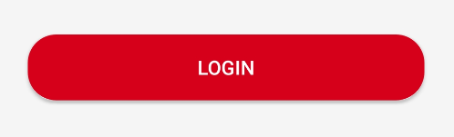
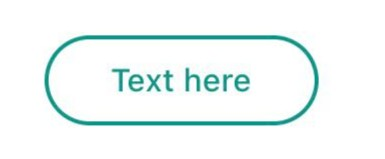
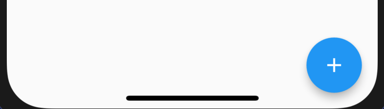
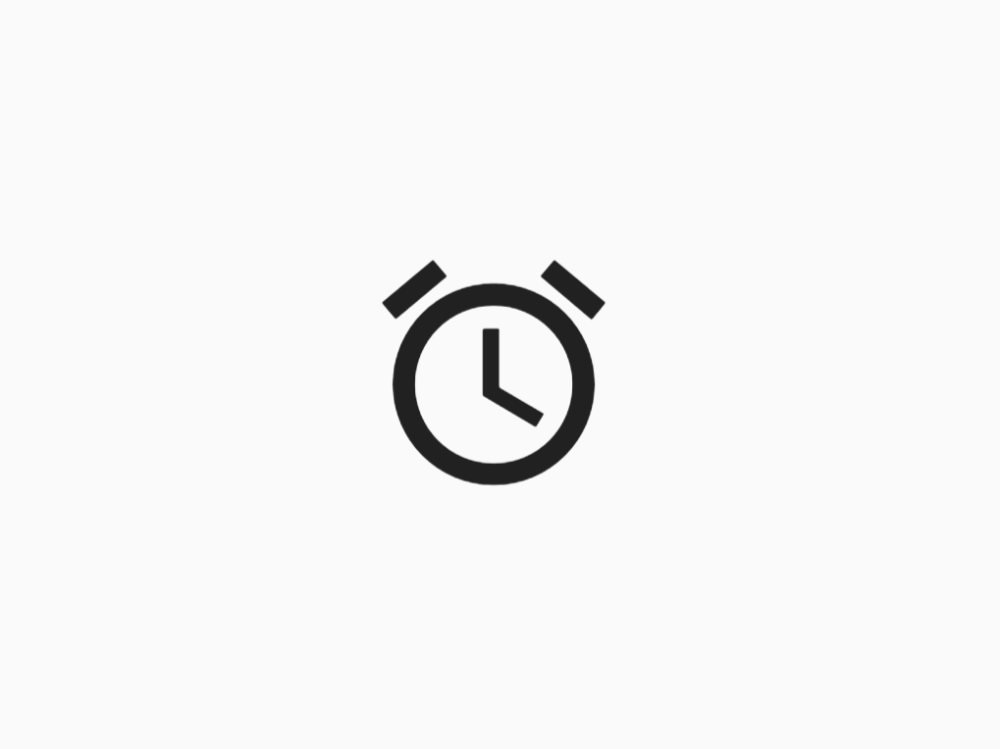

# Structure de base du fichier `main.dart`
```dart
void main() {
    runApp(MyApp());
}

class MyApp extends StatelessWidget {
    Widget build(BuildContext context) {
        return MaterialApp(
            home: HomeScreen()
        );
    }
}

class HomeScreen extends StatelessWidget {
    Widget build(BuildContext context)
    return Scaffold(
       appBar: AppBar(
        title: Text('Votre Titre')
       ),
       body: Center (
            child: ElevatedButton(
                child: Text('Votre Bouton'),
                onPressed: () {
                    print("Vous avez cliqué sur le bouton");
                }
            )
       ),
    );

}
```

`HomeScreen` est juste une classe normale, mais pour indiquer à Flutter que c'est un écran, vous devez ajouter `extends StatelessWidget`.

Et comme c'est une page, vous devez spécifier ce qui va être à l'intérieur avec le widget `build`.

<br>

# Scaffold
Permet d'avoir une conception prédéfinie avec une barre supérieure, un corps et une barre de navigation inférieure. <br>
Vous allez l'utiliser pour `chaque écran` que vous créez.

<br>

# Boutons
Il existe différents types de boutons: <br>

- `ElevatedButton` 



<br>

- `OutlinedButton`



<br>

- `TextButton` 


<br>

- `FloatingActionButton` 



<br>

- `IconButton` permet de rendre une <mark>icône cliquable</mark>. 



> icon: Icon(Icons.access_time)
<br>

`onPressed` permet de savoir quand le bouton est pressé. Vous devez le spécifier pour chaque bouton. Un bouton n'est pas là pour la décoration! 😏 <br>

Vous pouvez également ajouter d'autres options comme: 
1. `onLongPress`
1. `onSwipe`

<br>

# Supprimer la bannière de débogage
```dart
class MyApp extends StatelessWidget {
    Widget build(BuildContext context) {
        return MaterialApp(
            home: HomeScreen(),
            debugShowCheckedModeBanner: false // supprimer la bannière
        );
    }
}
```
<br>

# Barres
- `appBar` -> barre supérieure
- `bottomNavigationBar` -> barre inférieure
